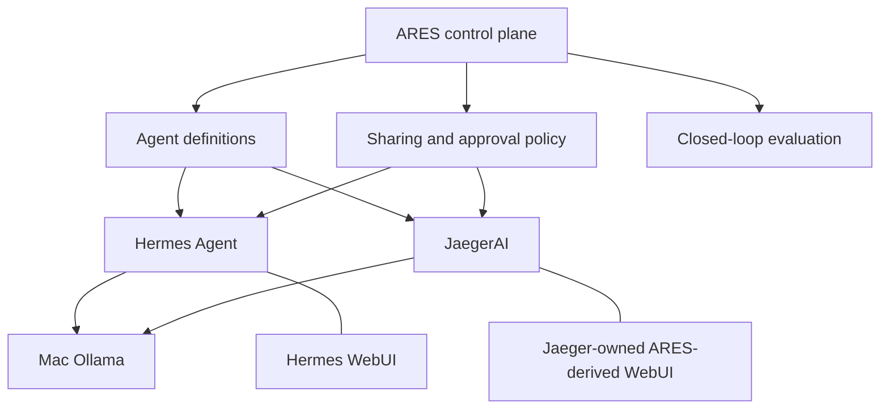

# ARES control plane

ARES is the autonomous reasoning, configuration, and governance plane above
independently owned Hermes and Jaeger runtimes. It is not a third chat agent and
does not absorb either runtime's tools, transcript, memory, or credentials.

## Ownership

- Hermes owns its runtime, tools, sessions, memory, schedules, and WebUI.
- Jaeger owns its runtime, tools, sessions, memory, schedules, and browser UI.
- ARES owns agent definitions, policy decisions, explicit sharing grants,
  evaluations, approvals, budgets, and closed-loop control records.
- Ollama owns model serving. Model weights remain on the Mac.

## Isolation and sharing

Isolation is the default. A resource crosses an agent boundary only through a
versioned `SharingGrant` naming the resource, grantee, access modes, optional
expiry, and approval requirement. The evaluator fails closed when no exact
grant exists.

Credentials are never copied into definitions or returned as values. A grant
contains an opaque reference such as `keychain://ares/github/jaeger`. A future
credential broker resolves the reference only while performing an authorized
operation and never exposes the secret to a session transcript or browser.

## Initial API

- `GET /api/control-plane/agents` lists definitions and states that isolation
  is the default.
- `PUT /api/control-plane/agents/{id}` validates and atomically persists an
  agent definition. Mutating access uses the controller's existing identity
  and CSRF/authentication dependency.
- `POST /api/control-plane/agents/{id}/evaluate` returns an auditable allow or
  deny decision. It does not execute the requested action.

Definitions are stored with mode `0600` under
`$ARES_HOME/control-plane/definitions.json` using an atomic replace.

## Development topology

- Hermes WebUI and Hermes Agent run in the stable Apple container.
- Jaeger bridge and its WebUI run natively from the JaegerAI working tree.
- ARES runs natively from its working tree while the control plane evolves.
- Browser access remains loopback-only locally and is published remotely only
  by authenticated Tailscale Serve routes.

## Closed-loop boundary

ARES may observe, evaluate, request revisions, approve within policy, or pause
an agent. It must not fabricate a human approval. Consequential effects remain
approval-aware, inspectable, and attributable to a definition and policy
version. The next phase adds durable evaluation events and action proposals on
top of this definition/policy foundation.
