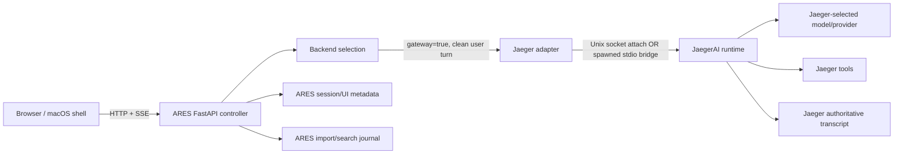

# ARES current-state audit — 2026-08-29

Scope: restored `codex-backup-20260828` working tree. This is a source audit plus
the failed Apple-container run observed on this Mac. It describes what exists;
it does not propose a rewrite.

## Executive finding

The prompt's premise is stale. ARES is not currently a dual-persona Hermes/Ares
agent runtime. Its own doctrine says ARES is a UI/controller and Jaeger owns
execution (`DOCTRINE.md:1-7`). The production Python path selects a registered
backend and starts its worker (`services/controller/api/chat_runtime.py:702-767`).
For Jaeger, that worker is `run_jaeger_streaming`, and Jaeger is explicitly
treated as the transcript-owning gateway (`integrations/providers/jaeger/backend.py:20-25`).

The current Apple-container deployment is not a valid ARES/Jaeger topology.
ARES was given a macOS checkout path that cannot exist inside Linux. More
fundamentally, the adapter discovers a Jaeger product root and launcher on the
same filesystem (`integrations/providers/jaeger/paths.py:25-62`) and uses a
Unix-domain socket or spawned stdio bridge (`integrations/providers/jaeger/paths.py:78-115`).
It has no network client for the separately running Jaeger container.

## Current-state diagram



Evidence for the clean-turn decision and worker spawn is
`services/controller/api/chat_runtime.py:702-767`. Evidence that the adapter is
a same-host subprocess/socket transport is
`integrations/providers/jaeger/backend.py:119-151` and
`integrations/providers/jaeger/paths.py:78-115`.

## 1. Entry points and lifecycle

| Entry | Status | Evidence |
|---|---|---|
| Repository launcher | Real | Root `start.sh` only resolves and execs `services/controller/start.sh` (`start.sh:1-14`). |
| Python server | Real | Module-level app is `create_app(enable_lifecycle=True)` (`services/controller/fastapi_app/main.py:57-128`). Core routers are installed before the frontend catch-all (`main.py:113-124`). |
| macOS app | Real, currently uninstalled | It is a menu-bar accessory app (`apps/macos/Sources/ARES/ARESApp.swift:301-315`). It adopts an existing controller, can start one on `--start-server`, and otherwise starts lazily when the window opens (`ARESApp.swift:320-363`). |
| Stay alive with window closed | Real only while the app remains alive | Closing a window keeps the controller unless the background-operation preference is off (`ARESApp.swift:366-370`). App termination stops it (`ARESApp.swift:373-377`). |
| Login persistence | Implemented for packaged native app, not the current container | `SMAppService.mainApp.register/unregister` implements launch at login (`apps/macos/Sources/ARES/NativeSystemBridge.swift:169-182`). No active ARES launch-at-login service remains on this Mac. |
| Container persistence | Deployment-level only | The local `/Users/matthewjenkins/AgentStack/start.sh` formerly restarted ARES by container name. It has now been removed because the runtime contract is invalid. |

Cold start creates state/session/workspace directories and runs recovery and
startup helpers in the FastAPI lifespan (`services/controller/fastapi_app/lifecycle.py:76-103`).
Startup failures in several optional helpers are deliberately downgraded to
warnings by `_best_effort` (`lifecycle.py:65-73`), so "server is listening" is
not proof that its agent dependency is usable.

## 2. Components: real versus named-only

| Component | Status | Evidence |
|---|---|---|
| EventBus protocol | **Interface only in production** | The Swift protocol defines typed subscribe/publish/history (`apps/macos/Sources/ARESCore/Contracts/EventBus.swift:3-22`). A repository-wide search found no production `: EventBus` conformer; only `DummyEventBus` in tests. Therefore it is not an end-to-end application bus. |
| ConversationMessageBus | **Real, separate mechanism** | It owns an in-memory message array and debounced persistence (`apps/macos/Sources/ARESCore/Conversation/ConversationMessageBus.swift:8-58`); user/assistant mutation APIs schedule saves (`ConversationMessageBus.swift:60-129`). It does not implement the `EventBus` protocol. |
| Reflection | **Missing as a scheduled ARES subsystem** | No production reflection runner, trigger, or reflection persistence owner was found outside text-cleaning and UI/docs references. The only direct controller match removes `<reflection>` tags from research output (`services/controller/api/research/utils.py:24-25`). |
| Session distillation | **Missing under that name/contract** | No production trigger defining a session boundary and writing a distilled artifact was found. Context compression exists, but compression is not evidence of episodic-to-semantic memory distillation. The architecture document's "Downtime Dreaming" statement is design intent (`docs/architecture/unified_agent_architecture.md:24`), not wiring. |
| 1-3-5 prioritization | **Missing** | No production schema, scheduler, or decision point implementing a 1-3-5 algorithm was found. Priority fields in reminders/Kanban are unrelated. |
| Turn journal | **Real** | Before a worker starts, ARES durably appends a `submitted` event containing the clean user text and routing metadata (`services/controller/api/chat_runtime.py:662-682`). |
| ARES journal/search DB | **Real, but not the agent transcript owner** | SQLite tables `conversations`, `messages`, `documents`, FTS indexes, and triggers are declared in `core/memory/journal/schema.py:15-118`; WAL and foreign keys are enabled at `schema.py:121-129`. |

Search method used for negative findings:

```text
rg -n --glob '!drafts/**' --glob '!**/.venv/**'
  'EventBus|reflection|distill|1-3-5|prioriti' core integrations services apps
```

Negative findings mean "not present in this audited tree," not proof that an
external Jaeger or Hermes runtime lacks such a feature.

## 3. Actual request data flow

1. The browser posts a user turn to the controller.
2. ARES resolves workspace/model/provider and marks the session pending
   (`services/controller/api/chat_runtime.py:624-653`).
3. ARES writes the submitted event before starting the worker
   (`chat_runtime.py:662-682`).
4. The selected backend returns `(worker, is_gateway, is_jaeger)`
   (`chat_runtime.py:702`).
5. Gateway workers receive only the clean user turn; stateless workers receive
   ARES-built conversation context (`chat_runtime.py:704-716`).
6. ARES applies standing directives to the execution prompt but persists the
   original clean user text (`chat_runtime.py:718-737`).
7. A daemon thread calls the backend worker and publishes boot failures to the
   UI (`chat_runtime.py:749-780`).
8. The Jaeger adapter uses its versioned bridge; Jaeger owns the live agent,
   tools, and authoritative transcript (`integrations/providers/jaeger/backend.py:20-25`).

There is no current Hermes-to-Claude handoff rule in this path. Model/provider
values are routing inputs, not two personas. Any claim of an automatic
Hermes→Claude escalation in ARES would be an inference unsupported by these
files.

## 4. Integrations

| Integration | Actual state | Evidence |
|---|---|---|
| Calendar/Reminders | Read-write native Swift implementation | Operations include list/create/search/delete events and list/create/complete/delete reminders (`apps/macos/Sources/ARESCore/MCP/Tools/CalendarTool.swift:8-41`). It uses `EKEventStore` (`CalendarTool.swift:130-135`) and requests full macOS authorization (`CalendarTool.swift:215-258`). This cannot work inside a Linux container; it requires the native app/helper and macOS privacy approval. |
| YouTube | Transcript ingestion, not YouTube account OAuth | The controller validates a YouTube URL, invokes `yt-dlp`, limits output, and writes a workspace artifact (`services/controller/api/ingestion.py:100-191`). It is registered as `ares_ingest_youtube` (`services/controller/api/ares_tools.py:315-318`). No YouTube Data API OAuth flow was found. |
| SQLite journal | Real | Exact schema described above (`core/memory/journal/schema.py:15-118`). |
| Jaeger | Real same-host contract; broken cross-container deployment | Product-root validation requires `jaeger_ai/` plus executable `jaeger` (`integrations/providers/jaeger/paths.py:25-31`). Socket discovery is filesystem-based (`paths.py:78-115`). |

## 5. Gaps and misleading states

1. **Health was too shallow.** The failed container served HTML and health
   endpoints while session listing returned 503 and the UI reported no Jaeger
   runtime. A listening HTTP port must not be reported as a working agent.
2. **Cross-container Jaeger is not implemented.** The adapter advertises a
   `stdio_bridge` subprocess transport (`integrations/providers/jaeger/backend.py:138-151`),
   not TCP/HTTP. Supplying a host path inside Linux cannot satisfy it.
3. **Errors can be collapsed into false emptiness.** `tools()` catches every
   bridge exception and returns `[]` (`backend.py:74-81`), making "unknown due
   to failure" look like "zero tools." `_tools_inventory` partly corrects this
   with an unknown flag (`backend.py:83-92`), but not every caller uses it.
4. **The EventBus architectural label overstates reality.** A protocol and test
   dummy exist, but no production conformer was found.
5. **Reflection, distillation, and 1-3-5 are design language, not active
   automation in this tree.** They need explicit owners, triggers, durable
   outputs, and acceptance tests before the UI promises them.
6. **Native macOS capabilities and Linux isolation conflict.** EventKit,
   Accessibility, microphone, speaker, and native MCP helpers cannot be assumed
   available from the container. The Jaeger log already reports missing
   `ares-native`, Apple Mail MCP, TTS, and macOS computer-use modules.
7. **Existing verification already records open Jaeger defects.** The prior live
   report says no real model turn completed and lists mocked restart/persistence
   boundaries (`docs/verification/jaeger-turn-path-evidence.md:197-236`). Those
   claims must be rerun against the current revisions before reuse.

## What breaks first under 24/7 load

1. **Dependency/transport availability:** ARES cannot attach to a Jaeger process
   in another container, so agent sessions fail before load matters.
2. **Silent capability degradation:** broad exception-to-empty fallbacks can
   make tools disappear without a hard readiness failure (`backend.py:74-92`).
3. **macOS integration loss:** a Linux container cannot service EventKit or
   Accessibility actions, so automation requests fail or lose capabilities.
4. **Background lifecycle ambiguity:** the native app, launch-at-login setting,
   controller process, container login task, and Jaeger daemon are separate
   owners. Without one supervisor and readiness contract, reboot and restart
   races are likely.
5. **Unbounded product surface:** duplicated WebUI assets and many optional
   integrations increase regression scope while the core agent boundary remains
   unproven.

## Audit conclusion

ARES should presently be treated as retained research/development source, not
an operational agent. The trustworthy interim stack is Hermes WebUI + Hermes
Agent for interactive work and Jaeger as a separately running, separately
auditable runtime. ARES can then be narrowed to the missing thinking-loop and
orchestration contracts without pretending its current Jaeger UI path works in
the container topology.
