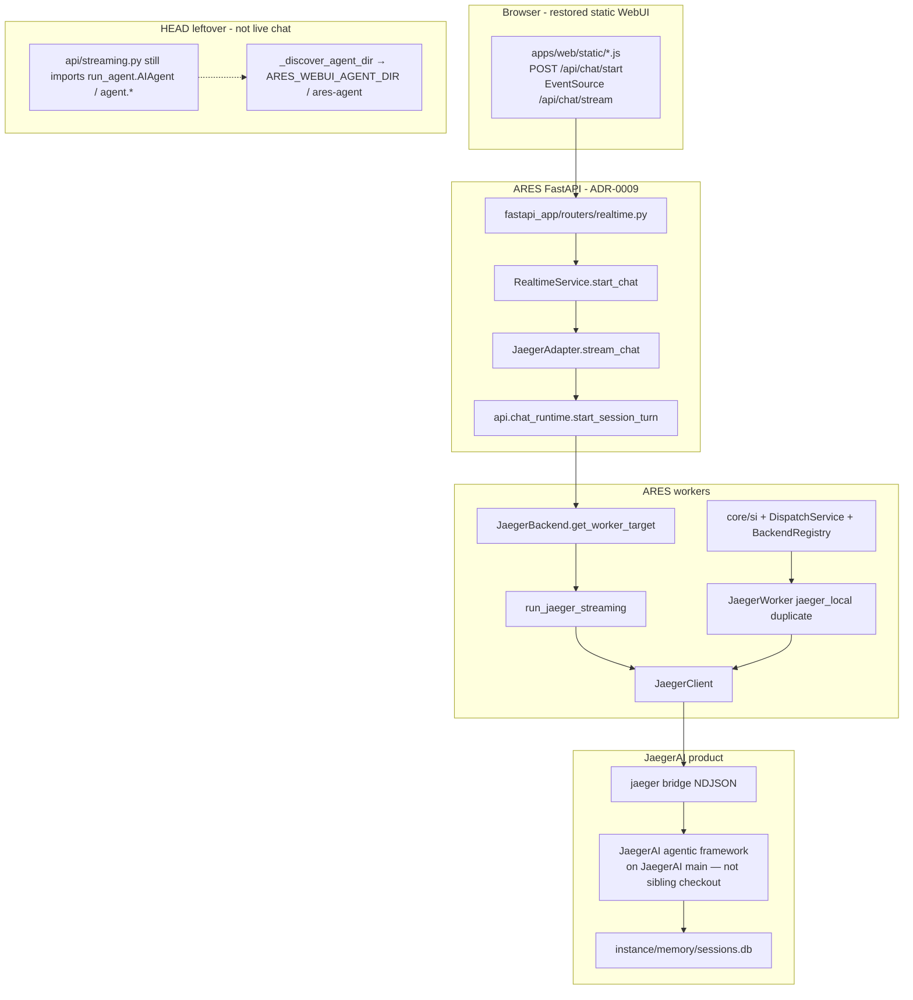
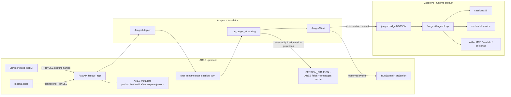

# ARES vs JaegerAI Ownership Cleanup

| Field | Value |
| --- | --- |
| **Title** | ARES vs JaegerAI Ownership Cleanup |
| **Author** | ARES recovery / architecture |
| **Date** | 2026-08-20 |
| **Status** | Draft (rev 5) |
| **In-scope repos** | `/Users/matthewjenkins/GitHub/ARES` (branch `fresh-reinstall-webui`, commit `6acb2bd0` plus a dirty overlay), `/Users/matthewjenkins/GitHub/JaegerAI` (branch `feat/jaeger-session-bridge-parity`) |
| **Out of scope** | `/Users/matthewjenkins/GitHub/jaeger-agent`. **JaegerAI main is the source of the agentic framework.** Do not modify that sibling repo, do not plan PRs there, do not run the live loop from its working tree. ARES still must not `import jaeger_ai` or `jaeger_agent`. |
| **Scope** | Ownership matrix, current-state audit (HEAD vs overlay), cleanup plan. **Not** the full WebUI↔Jaeger adapter wire-protocol design. |
| **ADRs** | ADR-0006 remains binding. **ADR-0009 remains the live chat registry** (`fastapi_app` → `JaegerAdapter` → `JaegerBackend.get_worker_target()` → `run_jaeger_streaming`). This slice does **not** replace that process with donor `server.py`. |

---

## Overview

ARES is the product control surface. JaegerAI is the canonical agent runtime and the only Jaeger-side repo this work may change. The restored Hermes **static** WebUI (`apps/web/static`, commit `6acb2bd0`) is the known-good **browser client**: it speaks HTTP + SSE (`POST /api/chat/start`, `EventSource` on `/api/chat/stream`). It does **not** speak `run_agent.AIAgent` and it does **not** speak Jaeger NDJSON. The adapter is a protocol translator between that browser contract and JaegerAI’s versioned stdio bridge.

On a clean clone of `fresh-reinstall-webui` @ `6acb2bd0`, live chat already follows ADR-0009:

```text
apps/web/static
  → FastAPI POST /api/chat/start  (fastapi_app/routers/realtime.py)
  → RealtimeService.start_chat    (fastapi_app/realtime.py)
  → JaegerAdapter.stream_chat     (fastapi_app/adapters/frameworks.py)
  → chat_runtime.start_session_turn
  → JaegerBackend.get_worker_target() → run_jaeger_streaming
  → JaegerClient → jaeger bridge
```

The working tree on 2026-08-20 is **not** that clone. It is a dirty overlay: 341 tracked deletions (including all 86 `fastapi_app/**/*.py` sources), 480 modifications, and 858 untracked paths (donor `server.py` / `routes.py` / `agent_runtime.py`, `integrations/jaeger_adapter/`, ~826 donor tests). **This Grok session did not create that overlay**; it was already on disk when ownership design started. PR 0 **audits** it: keepers are committed, discards are **moved to the Desktop** (never `git clean -fd`). Cleanup PRs then target the resulting committed tree.

This document freezes an implementable ownership matrix, lists violations on HEAD that remain after the overlay is audited, and sequences cleanup so later adapter-protocol work has a single owner per concern. Dual-write of authoritative state is forbidden unless a row is marked **projection only**.

---

## Background & Motivation

### Product direction (operator recovery plan)

1. Restore Hermes WebUI **static** code in ARES (done on the branch: `6acb2bd0`, `apps/web/static/` only).
2. Clean up Hermes **agent** context and callouts. Hermes agent is not the runtime.
3. Use the **existing** design. Do not invent a new product architecture.
4. Fix the adapter between the WebUI and JaegerAI.
5. Change the **JaegerAI** side (bridge frames/commands) to match the WebUI **HTTP/SSE** contract. Do not rework restored static JS to speak Jaeger NDJSON.
6. **In-scope repos: ARES and JaegerAI only.** **JaegerAI main is the source of the agentic framework.** Do not modify `jaeger-agent`. Do not use the sibling checkout as the live loop. Loop/prompt/tool-alias/heartbeat behavior ARES needs is re-implemented **inside JaegerAI**.

Implication: restored **static** WebUI is the client of record. FastAPI + `JaegerAdapter` is the committed ARES process. **JaegerAI main** is the runtime and the agentic-framework source. The adapter translates SSE ↔ NDJSON. Repositories stay two, not three. The sibling `jaeger-agent` working tree is not in the picture.

### What the existing design already says

Doctrine (`DOCTRINE.md`):

> ARES is a transparent product interface for reasoning and action, not a second agent runtime.

Contributor contract (`AGENTS.md`):

- JaegerAI owns agent turns, authoritative transcripts, tool calls, runtime history, skills, MCP configuration, credentials, models, and personas.
- ARES owns presentation, workspaces, projects, drafts, title overrides, pin/archive metadata, approvals UI, and combined projections.
- Cross-product operations use the versioned Jaeger bridge contract.
- ARES never reads or writes another product's private state.
- Retired Hermes/JROS **backend** names, environment variables, browser keys, and session prefixes must not be reintroduced.

Architecture (`docs/architecture.md`):

```text
User → ARES UI → ARES controller → versioned adapter → JaegerAI
```

Run-adapter RFC (`docs/rfcs/ares-run-adapter-contract.md`):

> the adapter should be a protocol translator, not a runtime surrogate.
> WebUI should be thin in execution ownership, not thin in product scope.

ADR-0006: ARES reaches JaegerAI **exclusively** through `JaegerClient` over `jaeger bridge` NDJSON. It does not import `jaeger_ai` or `jaeger_agent`. Capability is negotiated (`query: contract`).

ADR-0009: framework adapters (`fastapi_app/adapters/`) are the canonical execution registry. `JaegerAdapter` → `JaegerBackend`. `DispatchService` must not carry a second worker loop.

JaegerAI session contract (`jaeger_ai/interfaces/bridge.py::_session_contract`, `SESSION_CONTRACT_VERSION = 3`):

| Concern | Owner in Jaeger contract |
| --- | --- |
| transcript, execution_state, tool_calls, runtime_history | jaeger |
| workspace, project, pin, archive, display_title, draft | ares |
| tombstones | jaeger, durable |

### Why this slice exists now

`6acb2bd0` restored a working browser client. The **uncommitted** overlay then deleted the FastAPI process that client is supposed to call, dropped a donor Hermes HTTP server (`server.py` + 21k-line `routes.py`) on `sys.path`, and copied a Hermes-agent tree to `integrations/jaeger_adapter/` (untracked). Continuing adapter work against that overlay invents a second controller, forks cancel/steer, and silently reverses ADR-0009.

On **HEAD**, the remaining ownership bugs are real and smaller: `run_jaeger_streaming` dual-writes sidecar `messages[]`; `chat_runtime.start_session_turn` stuffs ARES history into the Jaeger prompt because `get_worker_target()` returns `is_gateway=False`; `JaegerAdapter.get_models` falls back to `import jaeger_ai.core…`; `streaming.py` still imports `run_agent.AIAgent` / `agent.*` for non-Jaeger leftover paths; two classes still claim `jaeger_local`.

---

## Goals & Non-Goals

### Goals

- Produce an ownership matrix an engineer can implement from, with **exactly one owner** per concern.
- Name the authoritative store/API for each concern. Dual-write is forbidden unless marked projection-only.
- Audit **committed HEAD** and the **dirty overlay** as two different trees. Classify every overlay path: restore, revert, or discard.
- Draw the Hermes-naming line: donor-internal JS identifiers vs product language vs retired backend names, in a form the source guard can enforce after the static restore.
- Keep ADR-0006 (never import Jaeger core) and ADR-0009 (FastAPI adapter registry is live chat).
- Assign Jaeger-side protocol gaps to **JaegerAI** (not `jaeger-agent`).
- Sequence cleanup as independently reviewable PRs that a clone of `6acb2bd0` can land.

### Non-goals

- Do not specify the full Jaeger-side wire-protocol implementation (event payload schemas, seq/cursor mapping, capability bump). Sketch only enough to assign owners and to stop claiming 1:1 mappings that are false today.
- Do not merge ARES and JaegerAI. Do not import `jaeger_ai` or `jaeger_agent` into ARES. Do not open PRs against `jaeger-agent`. Do not merge the dirty sibling working tree into `jaeger-agent` as part of this project.
- Do not shrink WebUI product scope.
- Do not rework restored **static** JS to speak NDJSON.
- Do not **commit** donor `server.py` / `routes.py` / `agent_runtime.py` / `integrations/jaeger_adapter/` as the new ARES controller.
- Do not introduce a thin `run_agent.AIAgent` facade as the execution strategy. That preserves donor **controller** Python, which is not the restored client.
- Do not decide daemon/launchd ownership (ADR-0006 left this open).
- Do not migrate SI/planner onto the chat path (ADR-0009 step 4).
- Do not delete JaegerAI’s own Swift/TUI/voice faces.

---

## Current-state audit

Two trees. Do not cite overlay facts as HEAD.

| Tree | What it is |
| --- | --- |
| **HEAD** | `git switch --detach 6acb2bd0`. Runnable description of ARES. FastAPI boots `fastapi_app.main:app`. |
| **Overlay** | 2026-08-20 working tree: `341 D` / `480 M` / `858 ??`. Not cloneable. Not the restore commit. |

`6acb2bd0` itself only touched `apps/web/static/` (verified). Controller Python on HEAD is the pre-restore ARES FastAPI stack plus Jaeger integration.

### 1. Committed HEAD (`6acb2bd0`) — the architecture to keep



**Live browser chat (HEAD, correct process, incomplete translation).**

- `fastapi_app/main.py` — uvicorn app factory.
- `fastapi_app/routers/realtime.py` — `POST /api/chat/start` → `RealtimeService.start_chat`.
- `fastapi_app/realtime.py` — `adapters.for_session(...).stream_chat(...)`.
- `fastapi_app/adapters/frameworks.py::JaegerAdapter` — `adapter_id = "jaeger_local"`; `stream_chat` calls `_default_turn_starter` → `api.chat_runtime.start_session_turn`.
- `api/chat_runtime.py` (~line 696) — `worker_target, is_gateway, _is_jaeger = selected_backend.get_worker_target()`.
- `integrations/providers/jaeger/backend.py::JaegerBackend.get_worker_target()` returns `(run_jaeger_streaming, False, True)`.
- `integrations/providers/jaeger/streaming.py::run_jaeger_streaming` — `JaegerClient`, frame translation, `_JaegerBridgeTurnControl` in `AGENT_INSTANCES`.

`fastapi_app` on HEAD: **86** tracked `.py` files (all missing on disk in the overlay).

**HEAD leftover Hermes/ares-agent coupling (not the chat router, still importable).**

- `api/streaming.py` still does `from run_agent import AIAgent` (HEAD ~569/584) and `from agent.image_routing` / `agent.auxiliary_client` / `agent.context_compressor` / `agent.model_metadata`. Title generation, compression estimates, and `cancel_stream` still live here. `JaegerAdapter.cancel_stream` delegates to `api.streaming.cancel_stream`.
- `api/config.py::_discover_agent_dir` (HEAD) uses `ARES_WEBUI_AGENT_DIR` and `ares-agent` candidates (`~/.ares/ares-agent`, sibling `ares-agent`, …). It does **not** read `HERMES_WEBUI_AGENT_DIR` and does **not** prefer `integrations/jaeger_adapter/`.
- `.env.example` on HEAD documents `ARES_WEBUI_AGENT_DIR=/path/to/ares-agent`, `ARES_WEBUI_BOT_NAME=Ares`, `ARES_WEBUI_COOKIE_NAME=ares_webui_session`.
- `api/auth.py` on HEAD defaults cookie to `ares_session`.

**HEAD ADR-0006 violation.**

`fastapi_app/adapters/frameworks.py::JaegerAdapter.get_models` (HEAD), if the bridge catalog is empty:

```python
from jaeger_ai.core.models.model_resolver import list_registered_models
```

**HEAD duplicate `jaeger_local`.**

- `integrations/providers/jaeger/backend.py::JaegerBackend`
- `integrations/workers/jaeger_worker.py::JaegerWorker`
- `integrations/workers/router.py` instantiates `JaegerBackend()` under `jaeger_local`
- `core/si/worker_registry.py` hardcodes a `jaeger_local` `WorkerRecord`
- `api/dispatch_service.py` still talks to `BackendRegistry`

**HEAD transcript dual-write (authoritative bug).**

1. `run_jaeger_streaming` merges assistant rows into `s.messages` (`merge_session_messages_append_only`, `msg["backend"] = "jaeger"`).
2. `chat_runtime.start_session_turn` treats Jaeger as **not** a gateway (`is_gateway=False`), so `build_context_prompt(...)` serializes sidecar history into the next `send` text. `_is_jaeger=True` is unpacked and unused.
3. ARES run journal (`api/run_journal.py`, `api/turn_journal.py`) records submitted events — projection, acceptable if it is not treated as the transcript.
4. Jaeger `sessions.db` also records the turn.

**HEAD session projection.**

`api/agent_sessions.py` still opens agent `state.db` read-only for CLI/cron sidebar rows. That is Hermes/ares-agent private schema, not the Jaeger `list_sessions` query.

**HEAD kanban** is already ARES-owned (`api/kanban_bridge.py` → `api.kanban_store`), not `hermes_cli.kanban_db`. Overlay reintroduced Hermes kanban; discard that.

**HEAD bot name** is split: `config.py` defaults `ARES_WEBUI_BOT_NAME` to `"Companion"` (~8970); `.env.example` comments `ARES_WEBUI_BOT_NAME=Ares`. Runtime default is **Companion**. PR 6 / `.env.example` must match `config.py` (not the other way around). Overlay `config.py` reintroduces Hermes discovery and donor strings.

**Contracts.** HEAD `api/contracts.py`: `MIN_SUPPORTED_INTEGRATION_CONTRACT_VERSION = 5`, `CURRENT_INTEGRATION_CONTRACT_VERSION = 7`. JaegerAI `INTEGRATION_CONTRACT_VERSION = 12`. Min-check is compatible; ARES `CURRENT=7` is **contract lag** to bump when ARES actually consumes v12 features.

**Steer/cancel client.** `JaegerClient.cancel` / `steer` take `session=` and `del session` — fire-and-forget on the single in-flight turn. They are **not** multiplexed per session. Reconnect-then-cancel only works if the same attached/spawned process is still the one running the turn.

### 2. Dirty overlay — not HEAD, must not be sequenced as the product

Working-tree counts (verified): **341 deleted**, **480 modified**, **858 untracked**.

| Overlay fact | Status | Action |
| --- | --- | --- |
| `services/controller/fastapi_app/**/*.py` (86 files) deleted from disk, pycache only | tracked `D` | **Restore** (`git checkout --`) |
| 114 `services/controller/api/*.py` deletions (e.g. `chat_runtime.py`, `contracts.py`, `session_contract.py`, `runtime_credentials.py`, `characters.py`, `persona.py`, `dispatch_service.py`) | tracked `D` | **Restore all unintended `D`**, not a short ownership-seam list |
| 119 test deletions including `tests/test_jaeger_ownership_literals.py` | tracked `D` | **Restore the file and rewrite the three-layer guard in PR 0** so CI is not red against committed static (`hermes-webui-session` in `boot.js` / `messages.js` / `sessions.js` / …) |
| `?? services/controller/server.py`, `?? api/routes.py` (~21k lines), `?? api/agent_runtime.py` | untracked donor HTTP server | **Move to Desktop** (not `git add`, not `git clean -fd`). Restored WebUI is static; this is a second controller. |
| `?? integrations/jaeger_adapter/` (~4,078 files, `git ls-files` count **0**) | untracked Hermes-agent copy + `jaeger_bridge.py` (`instance_name="jarvis"`) | **Move to Desktop.** Do not `git add`. |
| `?? services/controller/tests/` (~826 files) | untracked donor tests | **Move to Desktop** unless audit marks a fixture as a keeper (`git add`) |
| `M api/config.py` | overlay prefers `integrations/jaeger_adapter/`, dual-reads `HERMES_WEBUI_AGENT_DIR` | **Revert** to HEAD discovery (`ARES_WEBUI_AGENT_DIR` / `ares-agent` candidates) then a follow-up PR **retires** the ares-agent mount for Jaeger sessions |
| `M api/streaming.py` | overlay deepens `AIAgent` construction | **Revert** toward HEAD; remaining `agent.*` imports are a HEAD debt retired after Jaeger chat no longer needs them |
| `M apps/web/static/*` beyond `6acb2bd0` | mixed | Classify in the freeze: keep only intentional static WIP |
| Disk `.env.example` | `HERMES_WEBUI_AGENT_DIR`, `HERMES_WEBUI_BOT_NAME=Hermes`, `HERMES_WEBUI_COOKIE_NAME=hermes_webui_session` | **Revert** to HEAD ARES names. Cookie **code** default is still `ares_session` even on disk `auth.py`. |
| Disk `api/auth.py` | dual-reads `HERMES_WEBUI_COOKIE_NAME` | Revert or keep alias with a removal date (PR naming) |

Leaving FastAPI restored **and** donor `server.py` untracked yields **two bootable chat stacks**. Freeze must **move** the donor server to the Desktop (not leave it in the tree, not `git clean -fd`).

### 3. Restored static WebUI contract (the actual client)

Donor JS (`apps/web/static/messages.js`) does not import Python. It:

- `POST`s `/api/chat/start`
- opens `EventSource` on `/api/chat/stream?stream_id=…`
- listens for named SSE events including:
  `token`, `interim_assistant`, `reasoning`, `tool`, `tool_complete`, `todo_state`, `approval`, `clarify`, `state_saved`, `title`, `title_status`, `context_status`, `goal`, `goal_continue`, `done`, `stream_end`, `pending_steer_leftover`, `compressing`, `compressed`, `metering`, `apperror`, `warning`, `error`, `cancel`, `bg_task_complete`

`run_jaeger_streaming` today maps bridge `delta` → SSE `token`, `tool` → SSE `tool`, terminal → `done`, plus goal hooks. `state` frames are **dropped** (do not flicker thinking cards — keep that). Approval/clarify go through `on_request` → ARES widgets when `kind` is `approval` / `clarify` / `secret`.

**Incompatible / missing vs restored JS** (ownership assignment, not full schema):

| Browser SSE family | HEAD `run_jaeger_streaming` | JaegerAI bridge today | Owner of the gap |
| --- | --- | --- | --- |
| `token` | yes (`delta`) | `type=delta` (v9) | done |
| `tool` / `tool_complete` | partial (one `tool` event) | `type=tool` phases | JaegerAI richer phases; ARES maps names |
| `approval` | routed via `on_request` | `type=request kind=approval` | mostly done |
| `clarify` | routed if kind matches | Swift client knows `clarify`; `query: contract` features do **not** advertise it | **JaegerAI** advertise + emit; ARES already has the widget |
| `reasoning` / `interim_assistant` | no (and must not use `state`) | not a dedicated frame | **JaegerAI** |
| `cancel` / steer leftover | ARES `CANCEL_FLAGS` + `_JaegerBridgeTurnControl.interrupt` → `{"op":"cancel"}` | `op: cancel` / `op: steer` (no session multiplex, no bool, no tool-boundary timing) | **JaegerAI** semantics; ARES must not fake Hermes `steer()` |
| `max_turns` | WebUI config | `send_op` has no max-iterations field | **JaegerAI** protocol slice |
| `done` / `stream_end` | both today (`done` then `stream_end` at HEAD ~1044–1045) | `reply` | **ARES** maps `reply` → `done`. Restored JS (~6142) does `S.session=d.session; S.messages=_carryForwardEphemeralTurnFields(S.messages\|\|[], d.session.messages\|\|[])` — live tokens are replaced by `done.session.messages`. That array **must** be `{role, content, timestamp}` mapped from `load_session(resume=false)` **before** `done`, then `stream_end`. Empty `content` or a raw `{text,ts}` list wipes the turn. Default `load_session` (resume into the live agent) is forbidden here. |
| `bg_task_complete` | ARES `api/background_process.py` wakeup path | not a Jaeger frame | **ARES**. Do not wait on the bridge. |
| `title`, compression, metering | mixed ARES helpers still in `streaming.py` | session preview on Jaeger; titles are ARES `display_title` | ARES presentation; do not call `agent._run_codex_stream` |

Finishing **this** mapping is “change JaegerAI to match the WebUI contract.” It does not require `AIAgent`.

### 4. Live loop is the sibling `jaeger-agent` checkout — current-state violation

**JaegerAI main is the source of the agentic framework.** The sibling repo is not.

Verified 2026-08-20 on this machine:

| Fact | Value |
| --- | --- |
| `import jaeger_agent` from JaegerAI `.venv` | `/Users/matthewjenkins/GitHub/jaeger-agent/jaeger_agent/__init__.py` |
| `pip show jaeger-agent` | `Editable project location: /Users/matthewjenkins/GitHub/jaeger-agent` |
| JaegerAI `requirements.txt` | `jaeger-agent @ git+…@a592d01c4ee348c9d20cb0f19513a7e53e12c727` (hermetic pin, **not** what the venv is running) |
| `install.sh` | sibling overlay only if `JAEGER_DEV_SIBLINGS=1` (`~/GITHUB/jaeger-agent` etc.) |
| Sibling working tree | **uncommitted** 6 files / **+101 / −13**: tool-arg key stripping (`dialects/_shared.py`, `loop/jaeger_agent.py`), ARES MCP aliases (`notes` / `apple_notes` / `notes_tool` / `notes_operations` → `mcp__ares-native__notes_operations`), heartbeat / idle-board prompt fragments, cron `deliver`/`recipient` that **imports `jaeger_ai.core.runtime.cron_delivery` from jaeger-agent** (ownership inverted) |
| `jaeger_ai/modules/jaeger_agent.py` | still says jaeger-agent supplies the **loop** and JaegerAI supplies tools/prompt/persona/memory — that split is the defect, not the plan |

ARES/Jaeger issues were partly this: JaegerAI was not running **its own main**. Editable sibling + dirty ARES glue in that tree is a packaging/ownership defect, **not** approved work.

**This project:**

- Does **not** modify `/Users/matthewjenkins/GitHub/jaeger-agent`.
- Does **not** open PRs there.
- Does **not** merge those +101 lines into jaeger-agent.
- **Discards** the dirty sibling patches, or **re-implements** the needed behavior **inside JaegerAI** (aliases, heartbeat, arg-key normalize, cron delivery already in `jaeger_ai.core.runtime`).
- Runs JaegerAI from a **hermetic** venv (JaegerAI checkout + `requirements.txt` pin). `JAEGER_DEV_SIBLINGS` must be unset for ARES recovery. ARES still must not `import jaeger_agent`.

### 5. Hermes profiles (investigation — do not freeze a mapping)

Operator: ARES “profiles” come from Hermes agent (different configurations, models, or characters). **Do not** freeze “one Jaeger instance per companion / profiles are UI presets only.”

**What Hermes actually implements** (`/Users/matthewjenkins/GitHub/_hold/hermes-agent/hermes_cli/profiles.py`):

> Each profile is a fully independent `HERMES_HOME` directory with its own config.yaml, .env, memory, sessions, skills, gateway, cron, and logs. Profiles live under `~/.hermes/profiles/<name>/` by default. The "default" profile is `~/.hermes` itself.

| Piece | Path / code |
| --- | --- |
| Named profile root | `~/.hermes/profiles/<id>/` (`_get_profiles_root`) |
| Default profile | `~/.hermes` (`_get_default_hermes_home`) |
| Sticky active | `~/.hermes/active_profile` |
| Bootstrapped dirs | `memories`, `sessions`, `skills`, `skins`, `logs`, `plans`, `workspace`, `cron`, `home` (`_PROFILE_DIRS`) |
| Clone files | `config.yaml`, `.env`, `SOUL.md`, `memories/MEMORY.md`, `memories/USER.md` |
| Model/provider | `_read_config_model`: `config.yaml` `model.default` / `model.provider` |
| Description | `<profile>/profile.yaml` (`ProfileInfo.description`) |
| ARES wrapper | `services/controller/api/profiles.py` — process-level active profile, `HERMES_HOME` rewrite, `hermes_profile` cookie |

This is **not** a UI preset. It is an isolated agent home (config + secrets + soul + skills + memory + sessions). That is closer to a Jaeger **instance** (`~/.jaeger/instances/<name>/`: identity, config, memory, skills, credentials — `jaeger_ai/core/instance/instance.py`) **plus** soul/personality (Jaeger **character**). Hermes folds both into one directory.

**Follow-up (PR P), not this freeze:** choose one of:

1. **Copy the profile concept into JaegerAI** — isolated JaegerAI-owned homes (config, model, skills, memory, soul) with a versioned bridge list/create/use/delete; ARES UI remains the switcher.
2. **Repurpose ARES profile UI as Jaeger characters** (and/or instances) — map Hermes `SOUL.md` + `config.yaml` model onto `select_character` / instance config; do not keep a third `HERMES_HOME` tree.

JaegerAI owns **runtime meaning**. ARES owns **remaining UI**. Do not invent the mapping in this ownership freeze.

---

## Product decision: keep FastAPI, discard the donor controller

**Decision.** The restored WebUI is `apps/web/static` only. The ARES process remains `fastapi_app` (ADR-0009). Overlay donor controller files are **Desktop discards** after audit (not silent delete).

Rationale:

- Operator: use the existing design; do not invent a new architecture.
- Operator: do not rework restored WebUI **static** to NDJSON. Routing `/api/chat/start` at `JaegerClient` / `run_jaeger_streaming` already happens on HEAD and does not teach JS NDJSON.
- A thin `AIAgent` facade cannot satisfy overlay/`HEAD` `streaming.py` (`session_db`, `enabled_toolsets`, `inspect.signature` callback gating, `context_compressor`, title-gen private methods) without becoming a second Hermes runtime.
- Committing `server.py` + restoring `fastapi_app` creates two chat stacks.

**ADR-0010 is not required** as a replacement of ADR-0009’s execution entry. A short **amendment note** on ADR-0009 is enough: after the static restore, the browser client is donor JS; the server remains FastAPI adapters; `run_jaeger_streaming` is the Jaeger worker target; do not reintroduce in-process `AIAgent` as chat.

---

## Proposed Design

### Target shape



One `JaegerClient` cache (`_BRIDGE_CLIENTS`). One `jaeger_local` backend class. Zero Hermes loops on the Jaeger chat path. Zero `sys.path` mounts of `ares-agent` / `hermes-agent` / `jaeger_adapter` for that path.

### Adapter ownership (split by face)

| Face | Owner | Artifact |
| --- | --- | --- |
| Browser HTTP/SSE contract (event names the restored JS already listens for) | **ARES** | `fastapi_app/routers/realtime.py`, SSE fan-out, `run_journal` |
| Translator (bridge frames → those SSE names; controls → `op`) | **ARES** | `integrations/providers/jaeger/streaming.py`, `bridge_client.py`, `JaegerAdapter` |
| Runtime frames/commands (what the bridge emits so the translator can stay thin) | **JaegerAI** | `jaeger_ai/interfaces/bridge.py` + protocol fixtures in JaegerAI |
| In-process `import jaeger_ai` / `import jaeger_agent` | **Forbidden** | Delete HEAD `list_registered_models` fallback in the same freeze that restores `frameworks.py` |

Rejected: JaegerAI ships importable `AIAgent`. Privileges ARES vs Swift; reverses ADR-0006.

Rejected: ARES `run_agent.AIAgent` facade via `sys.path`. Recreates discovery bugs; collides with leftover trees; `inspect.signature` will not wire callbacks; revision guard would fire on every ARES commit.

Rejected: commit donor `streaming.py` as the product and ignore kwargs.

### Transport

| Transport | Status |
| --- | --- |
| stdio `jaeger bridge` / Unix attach socket | **Canonical** |
| `import jaeger_ai` / `import jaeger_agent` in ARES | **Forbidden** |
| In-process donor `AIAgent` loop | **Forbidden** on the Jaeger chat path; leftover `streaming.py` imports retired after non-Jaeger workers are out of this slice or gated |
| HTTP Jaeger gateway | Vestigial |
| WebSocket ARES↔Jaeger | Not authorized |
| Browser ↔ ARES | HTTP + SSE (restored JS). FastAPI currently also exposes a WebSocket chat stream route; browser uses EventSource. Do not require JS to switch. |

### Spawn, restart, reconnect

ADR-0006 did not pick a daemon owner. This slice does not either.

| Event | Behavior |
| --- | --- |
| Need a bridge, none listening | **ARES `JaegerClient.start()`** attach-socket first, else `Popen([jaeger, bridge, instance])`. This is spawn-on-demand, **not** ownership of the running process. |
| Bridge already owned by JaegerAI Swift/TUI | **JaegerAI** owns the process. ARES attaches. Must not `jaeger kill` a live peer. |
| Two ARES processes both spawn | Race (ADR-0006 open). Mitigate attach-first only. |
| WebUI process restarts mid-turn | **JaegerAI** keeps executing. ARES rediscovers via `list_sessions.execution_state` + journal. Pending approval survives only if Jaeger still holds the `request` id. |
| Cancel after reconnect | Only valid against the **same live bridge process**. `cancel(session=)` is ignored today (`del session`). Do not document multiplexed cancel until JaegerAI implements it (later protocol slice). |
| Stale pending | Journal + Jaeger `execution_state`. No third recovery DB. |

Turns are **serialized per Jaeger instance** (`_BRIDGE_TURN_LOCKS`). This is a local single-model companion, not a parallel-turn service. Expected bottleneck; state it, do not “fix” it in this slice.

### Hermes naming line (source-guard compatible)

HEAD `test_jaeger_ownership_literals.py` forbids substring `"hermes"` across `apps/web/static` except `extension_settings.js` and `messages.js`. Restoring that test unchanged against committed static **fails immediately** (`hermes-webui-session` is in `boot.js`, `messages.js`, `sessions.js`, `ui.js`, `commands.js`). Rewrite the guard to the three layers **in PR 0**; do **not** restore the blanket substring ban.

| Layer | Policy | Examples |
| --- | --- | --- |
| **Donor-internal identifiers** | Allowed in restored JS until a dedicated rename slice. Listed in the guard’s APPROVED key set, not a free pass. | `hermes-webui-session`, `hermes-webui-model`, `hermes-theme`, `hermes-skin`, `hermes_dismissed_approvals`, `hermes-clarify-draft-*`, `hermes-shell-__WEBUI_VERSION__`, `hermesExt` / `HermesExtensionSettings` |
| **Product language** | ARES / JaegerAI / Companion only in user-visible copy, docs, bot name, onboarding. | i18n must not tell users to run `hermes auth` or point at `~/.hermes/`. HEAD bot default is already `"Companion"`. |
| **Retired backend names** | Must not be how ARES finds or runs an agent. HEAD already dropped `HERMES_WEBUI_AGENT_DIR`; overlay reintroduced it — revert. | Overlay `HERMES_WEBUI_AGENT_DIR`, `integrations/jaeger_adapter` on `sys.path`, `from hermes_cli`, `from run_agent import AIAgent` on the Jaeger path, `ares-agent` source mount **for Jaeger chat**, session prefixes, JROS |

Dual-read aliases (`HERMES_WEBUI_*` → `ARES_WEBUI_*`): **removal date 2026-11-20** (90 days after this draft). Record in `CONTRIBUTING.md`. Cookie default stays `ares_session` (HEAD). Do not take overlay `.env.example` `hermes_webui_session`. Bot default is **`Companion`** (`config.py`); align `.env.example` (today comments `Ares`) in PR 6.

### Session identifiers

Jaeger contract: opaque, max 256, `emits_namespaces: false`.

| ID | Owner | Notes |
| --- | --- | --- |
| `session_id` | **JaegerAI** creates (`create_session`); ARES may propose the WebUI-minted opaque id | Same string both sides. No `webui:` prefix. |
| `stream_id` / ARES `run_id` | **ARES** browser observation key | Until JaegerAI echoes a run id, the adapter maps stream ↔ in-flight turn **locally** (projection). Not a second journal of record. |
| Tombstone | **JaegerAI** | Sidecar replay must not resurrect. |

### Combined projections

```text
sidebar row = Jaeger list_sessions() ⋈ ARES pin/archive/title/project/workspace/draft
```

- Tombstoned on Jaeger → hidden in ARES even if a sidecar remains (drop sidecar as cache).
- ARES-only empty draft (pin/title, no Jaeger row) allowed until first turn `create_session`.
- Cron/TUI/Swift sessions via `list_sessions` (Jaeger stamps cron running). ARES does not open `state.db`.

### Transcript writer (closes former Open Question 1)

**Single writer of authoritative `messages` during a live turn: JaegerAI (`sessions.db`).**

ARES `SESSION_DIR/{id}.json` `messages[]` is **projection only**. **Not** per-token append in `run_jaeger_streaming`.

**`load_session` is not a drop-in WebUI `messages[]`.** JaegerAI `query: load_session` (bridge.py ~859–879):

- **Default (no `resume: false`)** calls `resume_session_from_store` and **replays turns into the live agent**. That is a mutation for History → continue. **Forbidden** on the post-`reply` ARES chat path.
- **`{"id": shared_session_id, "resume": false}`** returns `SessionStore.history`: a **list** of `{role, text, ts[, metadata]}` (`sessions.py` ~222–240), **not** an ARES session dict.
- `redact_session_data` requires a **dict** (`helpers.py` returns `{}` for a list). Restored JS (~6142) reads `d.session.messages[].content`. Dumping `text`/`ts` rows as `messages` yields empty `content` and **wipes the live turn**.

**`done` mapping (PR 2 must implement this, not “call load_session”).** After bridge `reply`:

1. `query_local_companion("load_session", {"id": shared_session_id(session_id), "resume": False})`.
2. Map each history row → WebUI message: `content` ← `text`, `timestamp` ← `ts`; copy `role`; pass through `metadata` only if it is a dict of safe fields. Do not invent tool-call cards from metadata unless already in the ARES shape.
3. Merge that list onto the **existing ARES session object** (keep ARES-only sidecar fields: workspace, pin, archive, display_title, project, drafts, attachments already on the sidecar). Replace **only** `messages`.
4. If the query fails, or the mapped list has no user+assistant pair for **this** turn, emit `apperror`/`error` and **do not** emit `done`.
5. `put_event("done", {"session": redact_session_data(payload), "usage": usage})` where `payload` is that merged **dict**.
6. `put_event("stream_end", {"session_id": session_id})` (HEAD ~1045). Keep that order.

Mid-turn live SSE is the in-turn view; the sidecar may lag until step 3. The wipe risk is `done` with the wrong shape, not mid-turn flicker.

**ARES standing directives must not enter Jaeger user history.** `chat_runtime.start_session_turn` always runs `apply_directives()` today, including the `is_gateway` path. `send_op.text` is what JaegerAI records as the user row; `display_text` is for voice, not `sessions.db`. For `jaeger_local`:

- Honor `_is_jaeger` (currently unpacked and unused): skip `build_context_prompt`.
- Also skip `apply_directives` on the Jaeger `text` field. Pass `clean_message` as both `text` and `display_text`.
- Directives remain ARES-owned product metadata. Do **not** stuff them into authoritative transcripts until JaegerAI advertises a non-persisted context/system field (J2). Until then, Jaeger turns do not receive the directives block.

Offline paint: if the bridge is down, ARES may show the last projection cache and mark it stale.

---

## Ownership matrix

Exactly one owner per row. Producer vs translator vs fan-out are **separate rows**.

### Product / UX

| Concern | Owner | Authoritative store / API |
| --- | --- | --- |
| Browser WebUI (static workbench) | **ARES** | `apps/web/static/` |
| macOS shell | **ARES** | `apps/macos/` → controller HTTP/SSE, not `jaeger bridge` |
| Theming, i18n | **ARES** | static + macos lproj. Product copy is ARES; donor keys may linger internally |
| Session list presentation | **ARES** | `/api/sessions` join |
| Approvals **UI** | **ARES** | existing widgets / SSE `approval` |
| Approval **decision authority** (`once` / `always` / `deny`) | **JaegerAI** | bridge `request`/`respond`; instance `permissions.json`. ARES must **not** persist `always`/`once`/`session` locally for `source == "jaeger_bridge"`. HEAD `core/authority/route_approvals.py` (~397–401) still calls `approve_permanent` / `save_permanent_allowlist` on `always` even when `external_worker_pending` only skips `pending_keys` — `gateway_keys` and the save still run. PR 2b removes that write. |
| Workspaces, projects, file browser, drafts | **ARES** | ARES stores; workspace path on `send` |
| Pin / archive / display_title | **ARES** | sidecar / index. Jaeger preview is for Jaeger faces |
| Combined projections | **ARES** | join API; projection of Jaeger rows |
| Kanban workbench | **ARES** | HEAD `api/kanban_store.py` (already). Overlay Hermes kanban discarded |
| Browser SSE **event names and payloads the JS understands** | **ARES** | restored `messages.js` listeners; ARES translator must emit these names |
| Standing user directives (`apply_directives`) | **ARES** (product metadata) | `api/ares_directives.py`. Must **not** be concatenated onto Jaeger `op: send` `text` (that string is the authoritative user row). |

### Runtime / execution

| Concern | Owner | Authoritative store / API |
| --- | --- | --- |
| Agent turns | **JaegerAI** | `op: send`, agent loop inside JaegerAI |
| Tool implementations | **JaegerAI** | JaegerAI tool surface |
| Skills | **JaegerAI** | bridge skill queries/commands |
| MCP servers (agent tools) | **JaegerAI** | bridge MCP commands. ARES `mcp_server.py` is a **product** MCP server, different object |
| Credentials | **JaegerAI** | `list_credentials` / `set_credential` / `delete_credential` |
| Models / serving lane / fallback chain | **JaegerAI** | `model_catalog`, `serving_model`, configure commands. ARES displays **serving**, not requested |
| Personas / characters / identity | **JaegerAI** | identity/character queries. ARES `companion_control.py` projects |
| Authoritative transcripts | **JaegerAI** | `sessions.db` via session ops |
| Runtime NDJSON frames | **JaegerAI** | bridge stdout |
| Frame→SSE translation | **ARES adapter** | `run_jaeger_streaming._translate_bridge_frame` |
| SSE fan-out to browsers | **ARES** | `STREAMS` / EventSource (observation, not durable truth) |
| Cancellation / steer **semantics** | **JaegerAI** | `op: cancel` / `op: steer` as implemented (today: process-global in-flight turn, no session id, steer is immediate not tool-boundary). Gaps stay on JaegerAI until advertised |
| ARES cancel **button routing** | **ARES** | `/api/chat/cancel` → `JaegerClient.cancel` without faking Hermes `interrupt` message semantics |
| Max-turns | **JaegerAI** | not on `send` today; WebUI `max_turns` is a requested limit only after the protocol slice |
| Run journal | **ARES** | projection of observed SSE |
| Cached `AIAgent` / in-process loop | **Forbidden** on Jaeger chat | `_JaegerBridgeTurnControl` may sit in `AGENT_INSTANCES` as a control handle only |
| Goal state | **JaegerAI** if/when advertised; else ARES UI **unavailable** | **No** `update_goal` in current `BRIDGE_COMMANDS`. Do not invent a bridge query. HEAD ARES goal routes stay fail-closed / capability-gated |
| Slash commands / plugins (agent) | **JaegerAI** | capability query when advertised |
| Hermes/ARES **profiles** (isolated homes: model, config, soul, skills, memory) | **Investigate (PR P)** | Runtime meaning: **JaegerAI**. Remaining UI: **ARES**. Do **not** freeze “one instance / UI presets only.” See Hermes profiles investigation. |

### Integration

| Concern | Owner | Authoritative API |
| --- | --- | --- |
| `JaegerAdapter` / FastAPI registry | **ARES** | `fastapi_app/adapters/` (ADR-0009) |
| `JaegerClient` (ARES stdlib copy) | **ARES** | `integrations/providers/jaeger/bridge_client.py`. May lag JaegerAI `clients/python/jaeger_client.py`; pin with contract tests |
| Bridge protocol definition | **JaegerAI** | `jaeger_ai/interfaces/bridge.py` |
| Capability negotiation | **JaegerAI** advertises; **ARES** fail-closed | `query: contract` |
| Who may spawn a bridge | **Not an owner row.** ADR-0006 open. ARES may attach-or-spawn; JaegerAI owns the running process | `JaegerClient.start` |
| `integrations/jaeger_adapter/` | **Desktop discard** | `mv` to `~/Desktop/ares-overlay-discard-YYYYMMDD/`, never `git add`, never `git clean -fd` |
| Donor `server.py` / `routes.py` | **Desktop discard** | same |
| `jaeger-agent` repo / sibling working tree | **Out of scope** | Do not PR it. Dirty +101 patches are discarded or re-implemented in **JaegerAI**. Live loop must not be the editable sibling. |
| Agentic loop, prompt fragments, tool aliases, heartbeat for ARES | **JaegerAI** | JaegerAI-owned adapters / prompts / bridge / aliases on **JaegerAI main**. Not `jaeger-agent` dialects. |

### Data

| Concern | Owner | Authoritative store | Dual-write |
| --- | --- | --- | --- |
| Session IDs | **JaegerAI** | session contract | ARES may mint and pass through |
| Stream IDs | **ARES** | `STREAMS`, journal | projection of a Jaeger turn |
| Sidecar `messages[]` | **JaegerAI** is source; **ARES** cache | `load_session(resume=false)` mapped onto ARES session dict | **projection only** |
| Provider catalogs / auth status | **JaegerAI** | bridge queries | ARES UI cache |
| Secrets | **JaegerAI** | credential service | ARES never persists values |
| Workspace files | **ARES** (tree); agent writes are filesystem facts via Jaeger tools | workspace path | not a second DB |
| Instance internals (skills, memory, permissions, config) | **JaegerAI** | instance layout | ARES never opens |
| ARES settings, cookies, UI prefs | **ARES** | controller settings | |

### Failure / lifecycle

| Concern | Owner | API |
| --- | --- | --- |
| Running bridge process | **JaegerAI** | `ready` / `bye` / `fatal` |
| Attach-or-spawn client behavior | **ARES** `JaegerClient` | not lifecycle authority |
| Restart / reconnect observation | **ARES** rediscovers; **JaegerAI** remains run-state source | `execution_state`, journal cursor |
| Stale pending recovery | **ARES** journal + Jaeger `execution_state` | |
| WebUI restart mid-turn | **JaegerAI** continues | attach; else UI `interrupted` |

---

## API / Interface Changes

No new `AIAgent` class. No `sys.path` facade.

### `chat_runtime.start_session_turn` (ARES)

When `_is_jaeger` is true (`JaegerBackend.get_worker_target()` already returns it):

- Pass `clean_message` as worker input (same as gateway workers).
- Do **not** `build_context_prompt` from sidecar `messages[]`.
- Do **not** `apply_directives()` onto that input. Directives stay out of `op: send` `text` until JaegerAI advertises a non-persisted context field.
- Persist ARES metadata (workspace, model request) without appending assistant tokens. User/assistant rows in the sidecar come only from the post-`reply` projection in `run_jaeger_streaming`.

### `run_jaeger_streaming` (ARES)

- Stop `merge_session_messages_append_only` of generated assistant text as the owner write.
- After `reply`, **before** `done`: `load_session` with **`resume: false` only** (never the default resume/replay). Map `{role,text,ts}` → `{role,content,timestamp}`, merge onto the existing ARES session **dict**, `redact_session_data` that dict, then `done`, then `stream_end`. See Transcript writer. No `done` if mapping lacks this turn’s user+assistant pair.
- Pass `display_text=visible_user_text` only when it equals the clean user text (already the intent of `visible_user_text`). Do not put directives there either — Jaeger uses it for voice, but `text` is the persisted row.
- Keep `_translate_bridge_frame` mapping; add SSE names the restored JS listens for **only** when JaegerAI advertises the corresponding frame.
- Keep dropping `state` → thinking-card.
- `_JaegerBridgeTurnControl.interrupt` → `cancel()`; do not claim Hermes `interrupt(message)` or `steer() -> bool` tool-boundary semantics.

### Approval persistence (ARES)

`core/authority/route_approvals.py` on `choice == "always"`: `approve_permanent(key)` + `save_permanent_allowlist(_permanent_approved)` (~397–401). `source == "jaeger_bridge"` only zeros `pending_keys`; `gateway_keys` and the save still run. `once`/`session` still write `approve_session`.

For `source == "jaeger_bridge"`: map the choice onto bridge `respond` only. Do not call `approve_permanent`, `save_permanent_allowlist`, or `approve_session`. Jaeger `BridgeConfirmationProvider` owns `always` in instance `permissions.json`.

### `JaegerAdapter.get_models` (ARES)

Delete `from jaeger_ai.core.models.model_resolver import list_registered_models`. Empty catalog → empty list / health model only.

### `JaegerClient` (ARES)

Document `cancel`/`steer` as process-global in-flight ops. Do not pass session as if it were routed. Multiplex is a JaegerAI protocol slice.

### Discovery / `streaming.py`

- Freeze reverts overlay `config.py` off `jaeger_adapter` / `HERMES_WEBUI_AGENT_DIR`.
- Follow-up: Jaeger chat must not require `_AGENT_DIR` on `sys.path`. **Do not** remove the mount until the inventory below is green (every cell is bridge query, ARES store, or fail-closed UI). `hermes_cli` is absent on HEAD; overlay `hermes_cli` is discarded in PR 0.

### HEAD source-mount inventory (non-test)

`from agent.*` / `from run_agent` (10 modules):

| Module | Imports | Replacement |
| --- | --- | --- |
| `api/streaming.py` | `run_agent.AIAgent`; `agent.image_routing`, `auxiliary_client`, `anthropic_adapter`, `context_compressor`, `model_metadata` | **PR 5a.** Jaeger path uses `_JaegerBridgeTurnControl` only. Title/compression/image helpers: ARES store, `serving_model` / `model_catalog` query, or fail-closed. Delete `from run_agent import AIAgent` on this path. |
| `api/config.py` | `agent.credential_pool`, `agent.models_dev` | **PR 5b.** `list_credentials` / `model_catalog` for Jaeger; keep local fallbacks only for non-Jaeger workers until those workers have contracts. |
| `api/commands.py` | `agent.skill_commands`, `skill_bundles`, `account_usage` | **PR 5b.** Bridge `list_skills` / `skill_usage`; fail-closed if unadvertised. |
| `api/profiles.py` | `agent.secret_scope` | **PR 5b / PR P.** ARES profile switcher UI only; no agent secret-scope mutation. Runtime mapping is PR P. |
| `api/helpers.py` | `agent.redact` | **PR 5b.** Keep ARES `api.helpers` redaction (already has a fallback path); do not require the agent module. |
| `api/oauth.py` | `agent.anthropic_adapter` | **PR 5b.** Fail-closed / ARES oauth helper; not Jaeger chat. |
| `api/provider_credentials.py` | `agent.credential_pool`, `account_usage` | **PR 5b.** Bridge `list_credentials` for Jaeger. |
| `api/manual_compression.py` | `agent.model_metadata`, `manual_compression_feedback` | **PR 5b.** Fail-closed on Jaeger until advertised; ARES presentation only. |
| `api/model_context.py` | `agent.model_metadata.get_model_context_length` | **PR 5b.** `serving_model` / catalog `ctx`. |
| `fastapi_app/memory/compressor.py` | `agent.auxiliary_client`, `context_engine`, `model_metadata`, `redact` | **PR 5b.** ARES compressor must not import agent; fail-closed or local heuristic. |

`ares_cli` (17 production modules; comments-only in some):

| Module | Imports | Replacement |
| --- | --- | --- |
| `api/commands.py` | `ares_cli.commands`, `plugins`, `codex_runtime_switch`, `moa_config` | Bridge command/plugin capability when advertised; else `[]` / unavailable UI (already warns). |
| `api/config.py` | `ares_cli.models` | `model_catalog` for Jaeger. |
| `api/goals.py` | `ares_cli.goals` | Fail-closed until J1 advertises goals. **No** invented `update_goal`. |
| `api/profiles.py` | `ares_cli.auth.PROVIDER_REGISTRY` | Bridge auth/status queries; profile **homes** are PR P (JaegerAI). |
| `api/onboarding.py` | `ares_cli.auth`, `ares_cli.config.reload` | Jaeger `setup_defaults` / `instance_exists` / credential status. |
| `api/provider_credentials.py` | `ares_cli.auth`, `ares_cli.models` | Bridge `list_credentials` / `model_catalog`. |
| `api/live_models.py` | `ares_cli.models.provider_model_ids` | `model_catalog`. |
| `api/streaming.py` | `ares_cli.runtime_provider` | Unused on Jaeger path after 5a; delete or gate. |
| `api/manual_compression.py` | `ares_cli.runtime_provider` | Fail-closed on Jaeger. |
| `api/updates.py` | reads `ares_cli/__init__.py` under `_AGENT_DIR` | ARES updater must not inspect agent source. |
| `bootstrap.py` | `_agent_dir_from_ares_cli()` | Retire with the mount (after table green). |
| `api/dashboard_probe.py` | comment only | no code change |
| `api/kanban_bridge.py` / `kanban_store.py` | comments / optional 503 | HEAD persistence is `kanban_store` (ARES). Leave. |
| `api/workspace_git.py` | comment: no hard dep | Leave. |
| `api/worktrees.py` | `"ares_cli_worktree"` label | Rename label; ARES-owned worktrees. |
| `scripts/audit_agent_source_dependencies.py` | inventory script | Point it at this table. |

**Green condition for dropping `_AGENT_DIR` from `sys.path`:** every row above is bridge, ARES store, or fail-closed; CI grep finds no `from agent.` / `from run_agent` / `from ares_cli` under `services/controller` and `fastapi_app` outside tests. PR 5a does not drop the mount. PR 5b drops it.

### RuntimeAdapter flags (one execution selector)

Do **not** add `ARES_WEBUI_RUNTIME=jaeger-facade` or point `ARES_WEBUI_AGENT_DIR` at a facade package.

Existing `HERMES_WEBUI_RUNTIME_ADAPTER` / `ARES_WEBUI_RUNTIME_ADAPTER` (`legacy-direct` / `legacy-journal` / `runner-local`) selects **observation** (direct SSE vs journaled replay vs future runner client), not which agent loop runs. Jaeger execution is always `JaegerClient` for `jaeger_local`. Alias the env name to `ARES_WEBUI_RUNTIME_ADAPTER` in the naming PR; one flag.

### Goals / kanban

- Kanban: already ARES (`kanban_store`). Overlay Hermes bridge discarded.
- Goals: **not** in `BRIDGE_COMMANDS`. UI remains visible with unavailable state until JaegerAI advertises a goal feature. No fake `update_goal` query.

---

## Data Model Changes

No new databases. Reclassify.

| Store | After cleanup |
| --- | --- |
| Jaeger `sessions.db` | Authoritative messages, execution_state, tombstones, model/provider |
| ARES `SESSION_DIR/{id}.json` | ARES fields + **projection** `messages[]` from `load_session` |
| ARES `_run_journal` | Observation log |
| Hermes/ares-agent `state.db` | Unused by ARES Jaeger path. Stop `open_state_db_readonly` for that path |
| Overlay `jaeger_adapter` DBs | Never committed |

Migration:

1. New sessions: `create_session` with WebUI id, then ARES metadata row.
2. Existing sidecars with `messages[]` and no Jaeger row: one-shot `reconcile_session_transcript` on first open, then Jaeger owns.
3. Existing Jaeger sessions unknown to ARES: sidebar via `list_sessions`.
4. Do not copy Jaeger files into `$ARES_HOME`.

---

## Alternatives Considered

### Alternative 1 — JaegerAI ships importable `AIAgent`

Rejected. ADR-0006. Operator repos are ARES + JaegerAI talking over the bridge, not an in-process Python class.

### Alternative 2 — Commit donor `server.py` / `streaming.py` and thin-facade `AIAgent`

Rejected as the ownership strategy. Preserves donor **controller**, not restored **static**. Facade cannot satisfy `inspect.signature` + `agent.*` call sites without becoming Hermes. Two chat stacks if FastAPI is also restored.

A **bounded** change to leftover HEAD `streaming.py` (title/compression/cancel helpers) so they do not import `agent.*` **is** allowed later — that is controller Python, not restored JS.

### Alternative 3 — Keep overlay `integrations/jaeger_adapter/` and prune it

Rejected. Untracked 4k-file Hermes tree. `rm`. Do not commit then delete.

### Alternative 4 — ARES run journal as authoritative transcript

Rejected. Duplicates `sessions.db`. Journal stays projection.

### Alternative 5 — Successor ADR-0010 making `streaming.py` + facade the chat entry (draft 1)

Rejected. That described the overlay, not HEAD, and reversed ADR-0009. Amendment note on ADR-0009 instead.

---

## Security & Privacy Considerations

| Threat | Severity | Mitigation |
| --- | --- | --- |
| ARES child inherits controller secrets | High | Keep `minimal_bridge_environment()` |
| Dual-write credentials into sidecars | High | Projection redaction; no `api_key` kwargs into logs |
| In-process Hermes agent executes tools in the controller | High on overlay; HEAD Jaeger path already out-of-process | Discard overlay; do not remount agent source as rollback |
| `import jaeger_ai.core` in restored `frameworks.py` | High | Delete fallback in the freeze PR that restores the file |
| `jaeger kill` on a live Swift session | Medium | Attach-first |
| Approval `always` persisted in ARES | Medium | PR 2b: `source == "jaeger_bridge"` → bridge `respond` only; skip `approve_permanent` / `save_permanent_allowlist` / `approve_session` |
| Session id guessing | Medium | Opaque ids; controller auth unchanged |

---

## Observability

| Signal | Owner | Notes |
| --- | --- | --- |
| Bridge spawn / attach / bye / fatal | Adapter | instance, proto, contract version, attach vs spawn. No prompt text |
| Turn start/end | JaegerAI execution_state + ARES journal | session_id, stream_id, latency, **serving** model |
| Dropped/unmapped frame types | Adapter | bounded counter |
| Sidecar vs `load_session` divergence | ARES | counter after the projection-fill PR |
| Dual-path / `run_agent` on `sys.path` | ARES | alert if Jaeger chat imported `run_agent` |
| Contract lag | ARES | `CURRENT=7` vs Jaeger `12` — log negotiated version |

No info logs of tool args or transcript bodies.

---

## Rollout Plan

Team: this is a **local single-operator companion** (one model, serialized turns). No calendar is committed. **JaegerAI work in this ownership slice is J0** (hermetic loop / re-home leaked sibling patches) **and J1** (capability honesty). Protocol fill is a later design (J2). ARES PR 2 does not wait on J0 for mapping `load_session(resume=false)`, but local turns are not trustworthy until J0 replaces the sibling editable venv.

What stays broken until the matching PR: overlay tree is unaudited (PR 0); ADR-0006 import (PR 1); stuffed Jaeger prompts + sidecar owner writes + `done` wipe + directive pollution (PR 2); ARES `always` allowlist (PR 2b); duplicate `jaeger_local` (PR 3); `state.db` sidebar (PR 4); leftover `agent.*` / `ares_cli` imports (PR 5a/5b); product i18n hermes strings (PR 6); Hermes profile mapping (PR P). Chat on a clean HEAD already reaches Jaeger via the bridge.

**Rollback of overlay discards:** files live on the Desktop under `ares-overlay-discard-YYYYMMDD/`; `mv` them back if a keeper was misclassified. There is no `git clean` undo because we do not `git clean`.

**Rollback:** revert the ARES PR that flipped a behavior (projection fill, context stuffing). **Do not** remount Hermes/`ares-agent` source and **do not** `git add` `jaeger_adapter/`. Overlay discard is not revertible via git because it was never tracked — that is intentional.

Feature flags: do not add a second execution env var. Journal adapter flag remains observation-only.

---

## Risks

| Risk | Severity | Mitigation |
| --- | --- | --- |
| Freeze misses a needed `D` restore and FastAPI cannot import | High | PR 0 restores tracked HEAD `D` with `git checkout -- <path>` after audit; do not `git clean -fd` |
| Silent data loss of overlay files | High | Discards go to Desktop; keepers `git add`. This session did not create the overlay. |
| Restored JS expects SSE events Jaeger never emits | High | Capability-gate; UI unavailable (AGENTS.md rule 3); J1 advertises honestly before claiming parity |
| Projection-only `messages[]` — **`done` wipes the browser turn** | High | `load_session(resume=false)` **before** `done`; map `text`→`content`; merge onto ARES session **dict**; never emit `done` with `[]` or `{text,ts}` rows; never default resume. |
| Live JaegerAI venv is sibling `jaeger-agent` (editable) | High | PR J0: hermetic reinstall; re-implement leaked patches in JaegerAI; do not merge sibling diffs |
| Directive-prefixed `send.text` pollutes Jaeger user history | High | Skip `apply_directives` on `jaeger_local`; `text` = `display_text` = `clean_message` |
| Steer timing changes vs Hermes tool-boundary | Medium | Do not default “parity” until J2; document fire-and-forget |
| `cancel(session=)` ignored → wrong-turn cancel in a future multi-client world | Medium | Single in-flight turn today; J2 multiplex |
| SI `DispatchService` still on `BackendRegistry` | Low for this slice | Same `JaegerClient` after PR 3 |

---

## Open Questions

1. **Sidecar `messages[]` projection — closed.** Keep the cache. Fill from `load_session(resume=false)` mapped `text`→`content`, merged onto the ARES session dict, **before** `done`. Default resume `load_session` is off this path.
2. **Goals / remaining `ares_cli` / `agent.*` routes — inventory is in “HEAD source-mount inventory.”** Each row is bridge, ARES store, or fail-closed. Kanban is already ARES. Goals have **no** bridge command today.
3. **Hermes/ARES profiles — decided as an investigation, not a freeze.** Hermes profiles are isolated `HERMES_HOME` trees (`~/.hermes/profiles/<name>/`, `config.yaml` model/provider, `SOUL.md`, skills, memory, sessions — `hermes_cli/profiles.py`). **Not** UI presets. Follow-up **PR P**: copy that concept into **JaegerAI**, or repurpose ARES profile UI as Jaeger **characters** (and/or instances). JaegerAI owns runtime meaning; ARES owns remaining UI. Do not invent the mapping here.
4. **Daemon ownership** remains ADR-0006 open.
5. **FastAPI WebSocket `/api/chat/stream` vs browser EventSource.** Browser uses SSE. Leave the WS route until a dedicated deletion; do not require JS changes.
6. **Overlay audit — decided.** Do **not** `git clean -fd`. Audit 341 D / 480 M / 858 untracked: **keepers `git add`**, **discards `mv` to `~/Desktop/ares-overlay-discard-YYYYMMDD/`**. This Grok session did not create the overlay. Tracked `D` of HEAD FastAPI/api are restorations (`git checkout -- <path>`), not Desktop data.

---

## Key Decisions

1. **ARES owns product UX and metadata; JaegerAI owns execution and transcripts; the adapter owns neither.** Existing doctrine. Dual-write forbidden except marked projections.

2. **“Restored WebUI” means `apps/web/static` (commit `6acb2bd0`).** The client contract is HTTP/SSE. `from run_agent import AIAgent` is donor/HEAD **controller** coupling, not the restore.

3. **Keep ADR-0009.** Live chat stays FastAPI → `JaegerAdapter` → `run_jaeger_streaming` → `JaegerClient`. Untracked donor `server.py` / `routes.py` / `agent_runtime.py` go to the **Desktop discard bin** after audit, not `git add` and not `git clean -fd`. Do not ship ADR-0010 as a new chat entry.

4. **No thin `AIAgent` facade and no importable Jaeger `AIAgent`.** Operator “change JaegerAI” means bridge frames/commands matching restored SSE families. ADR-0006 stands.

5. **In-scope repos are ARES and JaegerAI only. JaegerAI main is the source of the agentic framework.** Do not modify `jaeger-agent`. Do not run the live loop from the sibling editable checkout (verified: JaegerAI `.venv` currently does). Dirty sibling patches (+101: ARES MCP aliases, heartbeat, arg-key strip, cron deliver importing `jaeger_ai` from jaeger-agent) are a defect: discard or re-implement inside JaegerAI (PR J0). ARES still must not `import jaeger_ai` / `jaeger_agent`.

6. **Authoritative transcript writer is JaegerAI.** ARES sidecar `messages[]` is a **mapped** `load_session(resume=false)` projection merged onto the ARES session dict **before** SSE `done`. Default `load_session` (resume/replay into the live agent) is forbidden on this path. `chat_runtime` must not stuff sidecar history **or** `apply_directives` into Jaeger `send` `text`.

7. **Hermes naming is three layers**, and the source guard must match them. Rewrite the guard in **PR 0** (do not restore the HEAD substring `"hermes"` ban). Backend mounts: overlay `HERMES_*` is drift; HEAD `ARES_WEBUI_AGENT_DIR` / `ares-agent` is leftover debt to retire **after** PR 5b. Alias removal date: **2026-11-20**. Bot default **Companion**.

8. **ARES may attach-or-spawn; JaegerAI owns the running bridge.** `cancel`/`steer` are not session-multiplexed today.

9. **PR 0 audits the overlay; never `git clean -fd`.** Keepers are committed. Discards are `mv`’d to `~/Desktop/ares-overlay-discard-YYYYMMDD/` (operator: do not lose data). Tracked accidental `D` of HEAD FastAPI/api are restored with `git checkout -- <path>`. Rewrite the three-layer ownership guard in the same PR so `test_jaeger_ownership_literals.py` is not CI-red. Delete the `jaeger_ai.core` fallback in the same restore of `frameworks.py`. This session did not author the overlay.

10. **One observation flag; no `jaeger-facade` env.** Execution for `jaeger_local` is always the bridge.

11. **Steer, max-turns, clarify advertisement, reasoning frames are JaegerAI protocol gaps.** Do not claim 1:1 mapping with Hermes `AIAgent.steer` / `max_iterations`.

12. **Hermes profiles are a named follow-up (PR P), not “UI presets.”** Isolated Hermes homes (config, model, SOUL, skills, memory). Copy into JaegerAI **or** map UI to Jaeger characters/instances after investigation. JaegerAI owns runtime meaning; ARES owns remaining UI.

---

## References

- ARES `DOCTRINE.md`, `AGENTS.md`, `CONTRIBUTING.md`
- ARES `docs/architecture.md`, `docs/vision.md`
- ARES `docs/decisions/0006-jaeger-access-boundary.md`
- ARES `docs/decisions/0009-canonical-execution-registry.md` (still the live chat registry)
- ARES `docs/rfcs/ares-run-adapter-contract.md`, `agent-source-boundary.md`, `webui-run-state-consistency-contract.md`
- ARES HEAD: `services/controller/fastapi_app/{main,realtime,adapters/frameworks}.py`, `api/chat_runtime.py`, `integrations/providers/jaeger/{bridge_client,backend,streaming,paths,companion_control}.py`
- JaegerAI: `jaeger_ai/interfaces/bridge.py`, `jaeger_ai/core/sessions.py`, `clients/python/jaeger_client.py`, `requirements.txt` pin, `install.sh` `JAEGER_DEV_SIBLINGS` (must be off for recovery)
- Sibling `/Users/matthewjenkins/GitHub/jaeger-agent` — **do not modify**; current editable venv + dirty patches are a violation to stop, not a workstream
- Donor static origin: `/Users/matthewjenkins/GitHub/_hold/hermes-webui/` (reference only)
- Overlay **Desktop discards** (do not `git add`, do not `git clean -fd`): `services/controller/{server.py,api/routes.py,api/agent_runtime.py}`, `integrations/jaeger_adapter/`, donor `services/controller/tests/` unless audit keeps a fixture
- Hermes profiles: `_hold/hermes-agent/hermes_cli/profiles.py`; ARES `api/profiles.py`; JaegerAI `jaeger_ai/core/instance/instance.py`

---

## PR Plan

PRs assume **PR 0 has audited the overlay**: keepers committed, discards on the Desktop, tracked HEAD `D` restored. Do not start behavior PRs on the dirty overlay.

JaegerAI PRs are **J0** (hermetic loop / re-home leaked sibling patches), **J1** (capability honesty), and **J2** (later protocol). ARES is not blocked on J2. J0 should land before trusting local Jaeger turns against ARES.

### PR 0 — Audit the overlay: commit keepers, Desktop the discards (ARES)

- **Title:** `chore(tree): audit overlay; restore HEAD controller; Desktop-discard donor debris; three-layer guard`
- **Repo:** ARES
- **Files/components:** audit 341 D / 480 M / 858 untracked; restore accidental HEAD `D` (86 `fastapi_app/**/*.py`, 114 `api/`, 119 tests) with `git checkout -- <path>`; `git add` keepers; `mv` discards to `~/Desktop/ares-overlay-discard-YYYYMMDD/`; rewrite `tests/test_jaeger_ownership_literals.py` (three-layer guard)
- **Depends on:** none
- **Description:** **This Grok session did not create the overlay.** It was already on disk. **Do not `git clean -fd`.** Operator: all modifications that are recovery work belong in a commit; anything we want gone is moved to the Desktop so it is not lost.

  Starting classification (must be confirmed line-by-line in the PR body):

  | Class | Action |
  | --- | --- |
  | Tracked `D` of HEAD FastAPI / `api/` / tests that ADR-0009 needs | `git checkout -- <path>` (restore canonical files) |
  | `M` that reintroduces Hermes mounts (`config.py`, overlay `.env.example`, deepened `streaming.py` AIAgent) | revert unless audit shows a keeper hunk |
  | `M` `apps/web/static/*` beyond `6acb2bd0` | keeper → `git add`; else copy to Desktop then restore HEAD |
  | Untracked `server.py`, `api/routes.py`, `api/agent_runtime.py` | **Desktop** (second controller; do not commit) |
  | Untracked `integrations/jaeger_adapter/` | **Desktop** (vendored Hermes agent) |
  | Untracked `services/controller/tests/` ~826 + donor docs | **Desktop** unless a named fixture is a keeper |

  Engineer shape (no `git clean`):

  ```bash
  STAMP=$(date +%Y%m%d)
  DEST="$HOME/Desktop/ares-overlay-discard-$STAMP"
  mkdir -p "$DEST"
  # after audit:
  git checkout -- <restored HEAD paths>
  git add <keeper paths>
  mv integrations/jaeger_adapter "$DEST/"
  mv services/controller/server.py services/controller/api/routes.py \
     services/controller/api/agent_runtime.py "$DEST/"
  # …remaining discard list from the PR body
  git status -sb   # empty except intended WIP + this PR's keepers
  ```

  Two chat stacks must not remain in the repo. Fold the three-layer guard rewrite here so restoring the HEAD ownership test is not CI-red against committed static (`hermes-webui-session` in `boot.js` / `messages.js` / `sessions.js` / `ui.js` / `commands.js`).

### PR 1 — Delete ADR-0006 fallback while restoring `frameworks.py` (ARES)

- **Title:** `fix(jaeger): stop importing jaeger_ai.core in JaegerAdapter.get_models`
- **Repo:** ARES
- **Files:** `services/controller/fastapi_app/adapters/frameworks.py` (may land inside PR 0 if that restore is a single commit; otherwise immediately after)
- **Depends on:** PR 0
- **Description:** Restoring HEAD verbatim reintroduces `from jaeger_ai.core.models.model_resolver import list_registered_models`. Delete that fallback in the same change-set that puts the file back. Empty catalog stays empty.

### PR 2 — Stop dual-writing Jaeger transcripts (ARES)

- **Title:** `fix(sessions): Jaeger owns messages; done carries load_session projection`
- **Repo:** ARES
- **Files:** `api/chat_runtime.py` (honor `_is_jaeger`: skip `build_context_prompt` **and** `apply_directives`; `text`/`display_text` = `clean_message`), `integrations/providers/jaeger/streaming.py` (remove owner append; `load_session` with **`resume: false`**; map `text`→`content`, `ts`→`timestamp`; merge onto existing ARES session **dict**; `redact_session_data`; `done` then `stream_end`; never default resume/`resume_session_from_store`), `api/models.py` helper, tests: no `done` with empty/`text`-keyed messages; no resume query on this path
- **Depends on:** PR 0
- **Description:** Names the single writer. Restored JS wipes live tokens on `done` unless `session.messages[].content` is populated. Default `load_session` mutates the live agent — forbidden here. Directives must not pollute Jaeger user rows.

### PR 2b — Jaeger approvals do not write the ARES allowlist (ARES)

- **Title:** `fix(approvals): jaeger_bridge choices respond on the bridge only`
- **Repo:** ARES
- **Files:** `core/authority/route_approvals.py` (skip `approve_permanent` / `save_permanent_allowlist` / `approve_session` when `source == "jaeger_bridge"`), `api/route_approvals.py` shim if needed, tests for `always`/`once`/`session`
- **Depends on:** PR 0
- **Description:** Today `always` still persists in ARES even for Jaeger pending prompts. Map the choice to bridge `respond` only. Can parallel PR 2.

### PR 3 — Single `jaeger_local` over one `JaegerClient` (ARES)

- **Title:** `refactor(workers): JaegerWorker delegates to JaegerBackend / shared client`
- **Repo:** ARES
- **Files:** `integrations/workers/jaeger_worker.py`, `integrations/workers/router.py`, `integrations/providers/jaeger/backend.py`, `core/si/worker_registry.py` (keep id)
- **Depends on:** PR 0
- **Description:** ADR-0009 intent without a second client. Can parallel PR 2.

### PR 4 — Sidebar from `list_sessions`, not `state.db` (ARES)

- **Title:** `fix(sessions): project Jaeger list_sessions; stop opening agent state.db`
- **Repo:** ARES
- **Files:** `api/agent_sessions.py`, session listing in FastAPI routers / `api/models.py`, `api/session_contract.py`, tombstone join tests
- **Depends on:** PR 2 (creates Jaeger rows for WebUI chats)
- **Description:** Combined projection per matrix. Does not require deleting every historical `state.db` string in comments in one PR, but **opens** of that SQLite file on the Jaeger path must go.

### PR 5a — Jaeger path must not import `run_agent` / `agent.*` (ARES)

- **Title:** `refactor(streaming): Jaeger cancel/title/compression without run_agent`
- **Repo:** ARES
- **Files:** `api/streaming.py` (delete `from run_agent import AIAgent`; `_JaegerBridgeTurnControl` for cancel; title/compression/image helpers off `agent.*` or fail-closed on `jaeger_local`), tests
- **Depends on:** PR 2, PR 3
- **Description:** First slice of the source-mount inventory. **Does not** remove `_AGENT_DIR` from `sys.path`. Overlay `hermes_cli` / `jaeger_adapter` are Desktop discards after PR 0, not `sys.path` mounts.

### PR 5b — Replace remaining HEAD `agent.*` / `ares_cli` imports (ARES)

- **Title:** `refactor(controller): drop ares-agent sys.path after inventory is green`
- **Repo:** ARES
- **Files:** `api/commands.py`, `api/config.py`, `api/goals.py`, `api/profiles.py`, `api/helpers.py`, `api/oauth.py`, `api/onboarding.py`, `api/provider_credentials.py`, `api/live_models.py`, `api/manual_compression.py`, `api/model_context.py`, `api/updates.py`, `api/streaming.py` (`ares_cli.runtime_provider`), `fastapi_app/memory/compressor.py`, `bootstrap.py`, `api/worktrees.py` (label), `scripts/audit_agent_source_dependencies.py`; then `api/config.py::_discover_agent_dir` / `_AGENT_DIR` `sys.path` insert
- **Depends on:** PR 5a
- **Description:** Execute the inventory table (bridge / ARES store / fail-closed). CI grep is the green condition. Only then drop `_AGENT_DIR` from `sys.path`. Goals stay fail-closed until J1. Kanban/workspace_git comments-only — leave.

### PR 6 — Product copy + alias date (ARES)

- **Title:** `chore(naming): Companion bot default; retire hermes auth copy; alias removal date`
- **Repo:** ARES
- **Files:** `apps/web/static/i18n.js` (no `hermes auth` / `~/.hermes` in user-visible strings); `services/controller/.env.example` (`ARES_WEBUI_BOT_NAME=Companion`); `CONTRIBUTING.md` (aliases die **2026-11-20**); do **not** mass-rename `hermes-webui-session` localStorage here
- **Depends on:** PR 0 (guard already rewritten)
- **Description:** Guard rewrite landed in PR 0 so freeze CI is green. This PR is product copy only. Cookie remains `ares_session`. Bot default **Companion** (match `config.py`, not `.env.example`’s `Ares`).

### PR 7 — ADR-0009 amendment note (ARES, docs)

- **Title:** `docs(adr-0009): static restore client; FastAPI remains the process`
- **Repo:** ARES
- **Files:** `docs/decisions/0009-canonical-execution-registry.md` (note), `docs/api.md` (still `fastapi_app/routers/` once restored), `docs/architecture.md` if needed
- **Depends on:** PR 0
- **Description:** No ADR-0010 chat-entry reversal. Records Key Decisions 2–3 and 9–10.

### PR J0 — JaegerAI main owns the loop; stop the sibling editable (JaegerAI)

- **Title:** `fix(runtime): hermetic loop; re-home leaked sibling patches inside JaegerAI`
- **Repo:** JaegerAI
- **Files:** JaegerAI-owned aliases / prompt fragments / arg-key normalize / cron delivery wiring under `jaeger_ai/` (not `jaeger-agent`); `jaeger_ai/modules/jaeger_agent.py` comments; install/docs: recovery must **not** set `JAEGER_DEV_SIBLINGS=1`; optional boot check that `jaeger_agent.__file__` is not a sibling working tree
- **Depends on:** none
- **Description:** Verified defect: this machine’s JaegerAI `.venv` editable-installs `/Users/matthewjenkins/GitHub/jaeger-agent` while `requirements.txt` pins `git+…@a592d01`. Sibling has uncommitted +101 (ARES MCP aliases `notes`→`mcp__ares-native__notes_operations`, heartbeat, tool-arg key strip, cron `deliver` importing `jaeger_ai` from jaeger-agent). **Discard those sibling diffs; do not merge them to jaeger-agent.** Re-implement anything ARES still needs **in JaegerAI**. Reinstall the venv hermetically from JaegerAI main. **No jaeger-agent PR.**

### PR J1 — Advertise real capabilities (JaegerAI)

- **Title:** `feat(bridge): contract features for clarify, reasoning, tool-lifecycle, goals`
- **Repo:** JaegerAI
- **Files:** `jaeger_ai/interfaces/bridge.py` (`query: contract` features), tests under `dev/tests/jaeger_ai/interfaces/`
- **Depends on:** none (can parallel J0)
- **Description:** Honesty only. Mark what the bridge **actually** emits. Do not add frames yet unless already present. ARES fail-closed depends on this. **No `jaeger-agent` changes.** All new frames live in JaegerAI.

### PR J2 — WebUI event-family parity (JaegerAI, later design)

- **Title:** `feat(bridge): SSE-matching frames (reasoning, tool lifecycle, clarify, run correlation, max-turns, session-scoped cancel/steer)`
- **Repo:** JaegerAI
- **Files:** `jaeger_ai/interfaces/bridge.py`, protocol fixtures, `clients/python/jaeger_client.py` (JaegerAI copy)
- **Depends on:** J1; **blocked on** the follow-up adapter wire-protocol design
- **Description:** Out of this slice’s implementation. Listed so ownership is assigned: **JaegerAI** implements frames inside the JaegerAI repo. ARES only maps names. Do not synthesize reasoning from `state`. `cancel`/`steer` session arguments become real or stay documented as ignored.

### PR 8 — Map newly advertised frames to restored SSE names (ARES)

- **Title:** `feat(adapter): translate advertised Jaeger frames into existing WebUI SSE events`
- **Repo:** ARES
- **Files:** `integrations/providers/jaeger/streaming.py`, `bridge_client.py` if new ops appear, tests against restored event names in `messages.js`
- **Depends on:** J1 at least; J2 for new frames
- **Description:** Translator only. No new browser event names unless JS already listens.

### PR P — Hermes profiles → JaegerAI profiles or characters (investigation + implementation)

- **Title:** `feat: map Hermes profiles to JaegerAI (copy concept or characters)`
- **Repo:** JaegerAI (runtime meaning) + ARES (remaining UI)
- **Files:** JaegerAI instance/character/bridge as the investigation chooses; ARES `api/profiles.py` UI only after the mapping exists
- **Depends on:** PR 0, J0 (hermetic JaegerAI)
- **Description:** Investigate donor `hermes_cli/profiles.py` (already summarized in §5) against JaegerAI instances (`~/.jaeger/instances/<name>/`) and characters. **Choose:** (1) copy isolated-home profiles into JaegerAI with bridge list/create/use/delete, or (2) repurpose ARES profile UI as Jaeger characters (and/or instances). Do not keep `HERMES_HOME` trees. Do not invent the mapping in PR 0.

Can parallel after PR 0: PR 1, PR 2b, PR 3, PR 6, PR 7, PR J0, PR J1. PR P is sequential after J0.
